---
format: html
webr:
  packages:
    - NHANES
    - dplyr

---

```{r}
#| label: setup
#| include: false

install.packages(
  "NHANES",
  repos = "https://cloud.r-project.org"
)

install.packages(
  "MASS",
  repos = "https://cloud.r-project.org"
)

install.packages(
  "car",
  repos = "https://cloud.r-project.org"
)

install.packages(
  "pwr",
  repos = "https://cloud.r-project.org"
)

cat("NHANES installed:", requireNamespace("NHANES", quietly = TRUE), "\n")
cat("dplyr installed:", requireNamespace("dplyr", quietly = TRUE), "\n")
```

# Part One

<!--
This is a book created from markdown and executable code.
See @knuth84 for additional discussion of literate programming.
-->

::: {.callout-note appearance="simple" icon=false}

## Key Takeaways

- Statistics supports learning from experimentation and data by connecting theory, prediction, observation and the continued refinement of our understanding.

- Statistical inference allows us to learn about a population from a sample while quantifying variability, measurement error and uncertainty; it cannot compensate for poor data or poor study design.

- Confirmatory data analysis (CDA) tests prespecified hypotheses using prespecified methods, whereas exploratory data analysis (EDA) aims at identifying patterns and generates new hypotheses; both are valuable, but their purposes and limitations must be considered and reported transparently.

- Probability describes uncertainty through experiments, outcomes, sample spaces and events. And, probability distributions are theoretical models used to approximate variability in observed data. The data type and scientific context help determine whether models such as the normal, lognormal, exponential, uniform, binomial or Poisson distribution are appropriate.

- Hypothesis tests evaluate how compatible the observed data are with a null hypothesis. P-values should be interpreted alongside effect sizes, confidence intervals, Type I and Type II error risks, and scientific or clinical relevance.

- Statistical methods should be selected according to the research question, data type, study design, estimand and assumptions, not through rigid rules about normality or sample size. Good study design additionally requires clear objectives, relevant outcomes, control of confounding and a justified sample size.

:::

# L1-1 Introduction

## Why should I learn about statistics?
So, you're here to learn about statistics. Luckily statistics is all about learning. You're probably familiar with George Box, the scientist credited with the saying: 

*“All models are wrong, but some are useful.”* George Box

Box was a chemist turned statistician, and relevant to this course, much of his work was concerned with how we can learn through experimentation, experimental study design and how statistical modelling can support experimental design and learning. 

In one of Box’s educational books on statistics, Statistics for Experimenters, he framed the use of statistics as a hypothetico-deductive learning process. Meaning that, through deduction we form theory - theory then informs predictions about reality – we then observe the phenomenon in the real world and collect new data – the data is used to update our theory and our hypotheses about how the world works. This description of learning can be applied to science as well as other everyday situations. 

We can frame the very same hypothetico-deductive learning process as a feedback system. We have devised a model which could be a theory or theoretical framework about how the world works - We make a prediction or deduction about the behaviour of a real-world system. Collected data about the system is a filter of sorts of what we observe in the real-world, it will be subject to some noise (variability and measurement error). That data will be used to update our prior model. We can then go on to make new predictions. The point being that, statistical models is a cornerstone in how we understand, predict, learn and refine our understanding of real-world and experimental systems (See **Figure 1.1**). 

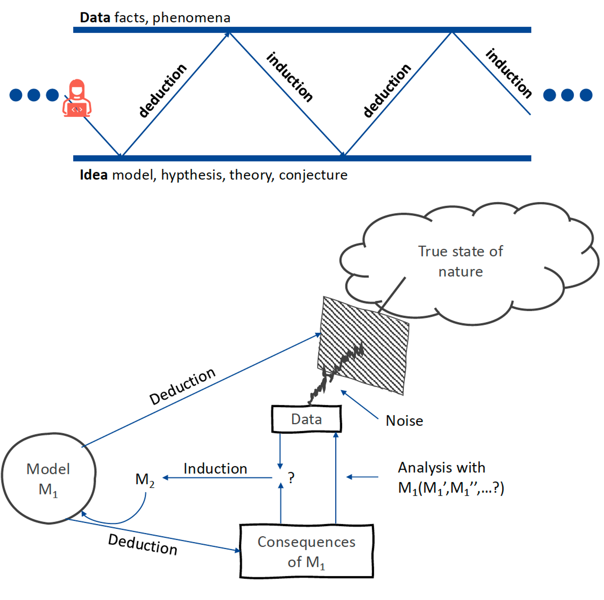

Hiffenburgh, in the book Statistics in Medicine, brings up two areas of application where statistics is helpful:\

1. When we do experiments, we're only observing a sample of the total underlying population. In order for our experiment to be useful we need to resolve the issue of how to make inferences about the overall population based on our smaller sample from the experiment.
2. When we measure or collect data in an experiment (or study). This will be associated with variability and uncertainty. How do we account for this experimental uncertainty. Are there ways for us to control for that uncertainty.

What statistic won't help us do is completely eliminate that uncertainty. It won't turn poor data into credible conclusions. You've probably heard the phrase garbage in, garbage out. A lot of responsibility is on the design of the experiment as well as the analysis. 

Back to George Box and the framing of the experimental system. You'll be hearing the word **experiment** a lot through out this course, so it is best that I specify what is meant by it. In statistics, an experiment is a procedure that will produce an outcome. In theory, we can reproduce or repeat this experiment an infinite number of times giving us a set of outputs or outcomes. These outcomes could be random in what's called a **random experiment**. Or they could be non-random or **deterministic** given a set of inputs or factors. One key challenge is that given a set of many factors (or inputs into a system), how do we deduce what factor(s) will produce what response(s)?

Statistical modeling can help us resolve the above challenge. Here the models can be simple statistical regression models all the way to very complex structural equation models. Another important aspect of the experiment is the data and variables we choose to collect (or observe). In medicine (and most disciplines), these data is almost always and without exception associated with some noise from the inherent variability in the experiments (experimental errors) and biological variability. Statistics give us ways of describing and quantifying (explainable) variability and (unexplainable) error or noise. This then helps us to design new experiments. Finally, as experimenters, we want to understand causation (cause and effect), but often it's not quite clear what is caused by an effector and what is simply an association. Again, here, statistics give us models for how to better understand how experimental systems could be operating, and then go on to try to quantify these relationships between variables. For instance, we could have a system where we have an input *x* and an output *y*, but there's also an intermediate *W* that will affect the same response (See **Figure 1.2**).

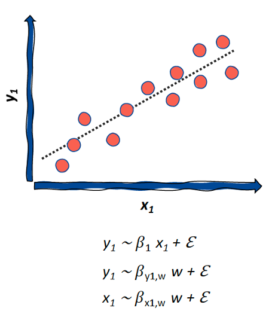

By modelling that intermediate we should better be able to understand causation. Importantly, statistics helps us to describe and quantifying uncertainty and probabilities. For example, we have an experiment where we're rolling a set of two dice. What are the potential or possible outcomes of that experiment? What's the likelihood of a given set of outcomes or an event to be occurring? We'll talk more about this in the coming sections. 

For other benefits of the statistical approach we can turn to the prominent, current statistician Andrew Gelman. In one of his blog posts, Gelman discusses how statistics can help us connect data to the underlying objects that we're trying to study in an experiment. More specifically, statistics can help us understand measurements and variables. For instance, the validity and reliability of measures and how these vary within subjects (so called intra-individual or inter-occasion variability) and between subjects (interindividual variability), and so on. 

## Ok, but how should I make use of statistics?
That's a good question (I'm glad you - or really I - asked), though I'm afraid there is no One correct answer. It all depends what you are trying to achieve. George Box gives quite a useful, high-level overview of how we can make use of statistics (See **Figure 1.3**). We will elaborate more on this throughout the course.

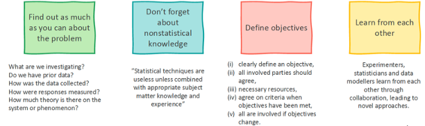

* Before conducting an experiment (not only before analysis - it could already be too late by then!) we want to find out as much as we can about the problem. E.g., is there prior data from the same type of experiment that we can use for data modelling to better understand what we should measure, how often we should measure, and in how many samples or individuals. 
* We shouldn't forget the domain specific knowledge that is key to understanding the problem e.g., the theory of the given discipline. A statistical modeling exercise is rarely about satisfying the curiousity of the statistician or data modeller. It is therefore super important to involve domain experts, e.g., the medical profession for medical problems, etc. We can use this prior knowledge to construct models (or hypotheses) that we then go on to test. 
* We then want to define objectives. This is a group effort within a research or development team. Ideally, the team is interdisciplinary enough that you will not forget any important study design aspects. 
* Finally, Box raises the need to learn from each other across disciplines, from experimenters, domain experts, users and patients, statisticians, to data modelers, and more.

This all sounds well and nice, but why is it important? One of the research has faced during the last decade is the replication crisis. The issue was first raised in psychology but it turns out it was not limited to psychology alone, in following studies the issue of lack of replicability has been seen in biology, medicine, engineering, and more. Part of the issue is due to publication bias. But there's also an interesting angle here around the statistical approaches that we used and also how these were presented to have been used. We can view statistical methods as a spectrum of different ways of analysing and interpreting data. For example the more traditional approach, that most of you have experienced in conventional introductory statistics courses is referred to as confirmatory data analysis (CDA). This is when we aim to confirm or refute an a priori formulated hypothesis (or a set of hypotheses) using an a priori defined statistical analysis method.

This is predicated on a set of rules and assumptions that should be met before we do this type of analysis. For instance, given the model or analysis methods, the key assumptions of that method need to be met. In CDA, we should pre specify our intended study power and what the sample size of that experiment should be. We only test one hypothesis. If we test multiple, we make sure to account for multiple testing. This rigid, somewhat formulaic, approach aims to reduce the risk of bias in the conclusions that we can draw. Most often, we find ourselves doing something in between a CDA and a more exploratory data analysis (EDA). Perhaps, rather than confirm or refute a hypothesis, we want to evaluate experimental data. Rather than looking for statistical significance, we're looking to estimate effect size or a set of model parameters. We then might be asking - what's the uncertainty in our parameter/effect size estimates? EDA was very much pioneered by John Tukey. During EDA we're more interested in exploring patterns, perhaps in large datasets. We do not have an a priori hypothesis going into the analysis. You can see a summary of these approaches in **Figure 1.4**.

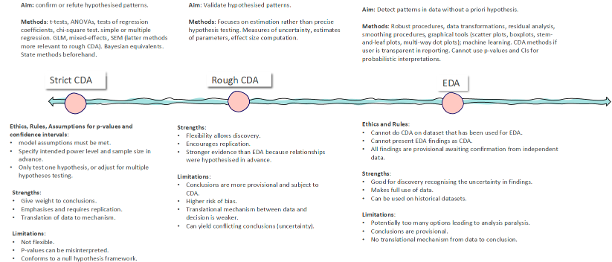

This makes sense. Usually, we want to have some flexibility in the type of questions we ask given a dataset so we adapt the statistical approach to the data we are investigating so we can carry out the most suitable statistical analysis, right? No, stop, wait(!) - here is a potential big red flag. During EDA we're introducing potential risk of bias in the conclusions that we draw. We can't state with certainty that the conclusions that we draw during a rough CDA/EDA analysis will refute or confirm a hypothesis. These conclusions remain provisional pending further experiments and further statistical analysis. And, once we conduct EDA on a dataset, we cannot use the same datasets for a strict CDA approach. Because the choice of analysis would already be informed by the same dataset. In other words - a more exploratory approach will be excellent for finding potential avenues of further research, but we cannot draw any firm conclusions based on this analysis.

Fife and Rogers (2021) explain the issue perfectly. Because of the limitations in the conclusions we can draw given EDA (or a rough CDA) it is super important that we are transparent in the way we present our statistical analysis to others (stakeholders, readers, etc.). By concealing our intentions and presenting an exploratory analysis as a strict CDA, we run the risk of performing p-hacking. That is when we find the optimal analytical methods to get the best possible p-value. 

In other instances we might run the risk of fishing - when we conduct multiple statistical analyses across the dataset and present only those that are statistically significant, through multiple testing the likelihood of obtaining a statistically significant result increases. If we are dubious in our methods, we risk HARKing so hypothesising after the results are already known. 

This all to say, there is merit to the classical strict CDA, EDA and everything in between. But we need to recognise the limitations of each approach and be transparent about our intentions in our analyses, experiments and how these are presented. 

# L1-2 Probability
In the previous section I briefly brought up the concepts probability and uncertainty and their role in statistics. Probability theory and sampling distributions is very much central to classical statistics and important for understanding the random experiment. I will briefly describe probability to then delve further into distributions. For more details, see the recommeded reading (Lavin 2013, Chapter 1). 

## What is statistics about?
Probability, or uncertainty, is key part of what statistics is about. Probability can be described using four concepts: 

* **The Experiment** A procedure that we can repeat. In theory, an infinite number of times, and it will produce a well-defined set of outcomes. For example, we could consider an experiment consisting of rolling a die, the outcomes of which are a value of 1 to 6. 
* **Sample Outcome (*s*)** Each potential outcome is a sample outcome.
* **Sample Space (*S*)** The totality of outcomes is the sample space.
* **Event** A collection of sample outcomes. An event can occur if an experimental Outcome is a member of an event. 

Probabilities work different depending on if we are looking at discrete cases, such as counting the outcomes after rolling a die a number of times. Or, continuous measures (length, weight, volume, concentrations, amounts etc.) where we can use integrals to determine the probability of producing an outcome within a given range of values.

As is done in Lavine 2013, let's start by looking at the discrete case. We call these counting outcomes. That means that we have a number of set discrete outcomes. For example, when rolling a single die we can produce outcomes between 1 and 6. If we are rolling two dice, we can produce 6 times 6, or 36 potential outcomes. This is the complete sample space of rolling two dice, (or *S*).

The probability of producing an outcome within the sample space *S* (the totality of outcomes) is one. While, the probability of producing the null set, a set containing none of the possible outcomes (also called an empty set or $\emptyset$), is zero. 

In set theory we can have events that are made up of several sample outcomes (*s*). In Figure 1.5 I have marked two different events (sets of sample outcomes, *s*), event A in blue and event B in red. We can calculate the probability of these events given the set outcomes. For example, the probability of the unison ( $\cup$), meaning producing an outcome from A or B, is equal to the probability of A plus B if A and B do not intersect, (A $\cap$ B = $\emptyset$). In other words, the intersection between A and B is a null set that in effect is empty or impossible. To clarify, the intersect is empty because there is no overlap.

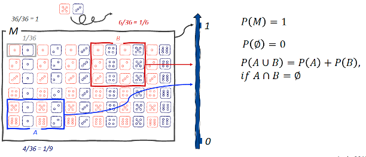

Most medical, biological data tend to be continuous. A short side note: In the video I bring up one of the groundbreaking works in the field of systems biology where Ludwig von Bertalanffy defined a model of the length of sea creatures over age. The work by von Bertalanffy (and others in the 1920's and 1930's) layed the foundations for mathematical systems modelling in biology and medicine. If you find this interesting, I talk about this in more detail in Simulation course (CM2014). 

How do we treat probabilities for continuous data? here we can use the integrals of the probability density function (*pdf*) to determine the probability of ranges of values (outcomes). What is a *pdf* (other than a file format)? The pdf describes the likelihood of a continuous random variable falling within a particular range of values. For example, within the range of A to B (See Figure 1.6), what's the probability of producing a value within that range. The *pdf* which is the derivative of the cumulative ditribution function (*cdf*) which gives the probability that a random value is less than or equal to a given, defined value. So, the *cdf* is the accumulated area under the probability density curve up to the given, defined value. 

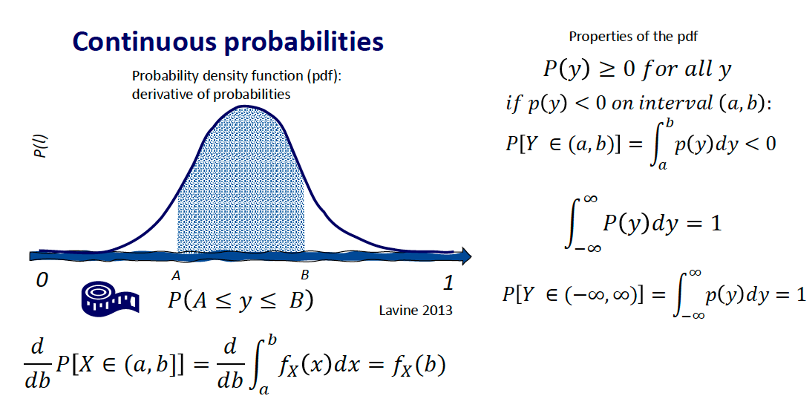

*Pdf* functions have a set of properties. One of these is that the probability of *y* is over or equal to zero for all *y*, because otherwise, the probability of a value between A and B could potentially be negative. The other property of the pdf is that the probability of *Y* being a set of -$\infty$ to $\infty$ is one. Integrating over that range gives a probability of one. Another interesting property of the *pdf* is then if we integrate over a singular value, which can be viewed as an infinitesimally small range between *A* and *A*, or *A* and *B* (where *A=B*), this will give a probability of zero because the integral is the area under the curve. In other words, for a vertical line on the distribution curve the area is zero. The probability of a continuous random variable is given by the area under the pdf. 

The *cdf* gives us the probability of the random variable taking on a value less than or equal to a fixed real number. We can get the cdf by integrating the *pdf*. We can get the pdf by differentiating the *cdf*. These are two different representations of the probability distributions. We'll look more at probability distributions in the coming section. 

# L1-3 Data Types and Distributions
Here I'll cover of few common data types and their associated probability distributions, I'll also start introducing some *R* scripts throughout the different examples. In the previous section I talked about probability as a way of understanding the likelihood of a set of outcomes (events) given some underlying distribution. Let's take a closer look atdistributions. 

One way of parsing through different distributions is by exploring different data types, this is because our expectations change with regards to what the assumed (theoretical) distribution of the data is given the type of data. Data in this context is the observed output of the experiment, as examplified by experimental system presented in section L1-1. If we have an experimental system like the one that George Box presents, where we have a set of factors (*k*) and observed outputs (*p*) from the experiment, the output or response (*p*) is the data. Figure 1.7 presents a common approach to defining data types, as numerical and categorical, and the different subclasses.

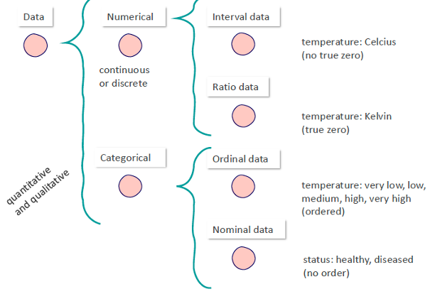

A side note, Figure 1.7 highlights an interesting experimental design aspect. Given a research question (*e.g.*, how does body temperature differ between condition A and B?), what measure should be used? As data modellers we may have a saying in these decisions, the data type may certainly play a role along with other factors (such as, validation of instruments, the ability to aggregate data across studies, and more). 

We can conclude that different distributional models may be assumed based on the data type of an observed experimental output (among other considerations). But what is a distribution? A distribution, or probability distribution, is a Theoretical or Conceptual model of what we Think the underlying distribution of the data looks like. A distributional model (such as a normal, lognormal or uniform distribution) is not a natural law to be strictly adhered to or else suffer the consequences. These are theoretical models the we use to represent variability in data (samples of a population) to make inferences about an underlying population. We do not declare: "these data have been determined to be normally distributed!". Rather, we may conclude that a normal distribution is a reasonable description of the observed data and an adequate approximation of the population distribution for the intended analysis. That is sufficient and good enough. So, the next time someone asks you for the hundreth time whether the data are normally distributed, you know what to say. :-)

We can represent an underlying distributional model in different ways. The most straightforward way is to calculate summary statistics (*e.g.*, a mean, median, standard deviation, percentiles, etc.). Or, we can represent the distribution through a probability density function or probability mass function (*pmf*) if the data are discrete. The *cdf* or *pmf* can then be used to define the probability of obtaining a value within a set range. Another way of representing distributions is through the cumulative distribution function. The *cdf* gives the cumulative probability of obtaining a certain value up to *x*.

Typically we represent data using parametric distributions. These are a class of distributions that can be defined by parameters. You're probably familiar with many of these, for example the normal distribution can be defined by μ, the mean, and the σ², the variance. All parametric distributions are described using different shape parameters, these give useful approximations for representing and interpreting data. We will look at some of the most common parametric distributions here underneath. 

## The Normal or Gaussian Distribution
The normal, or Gaussian, distributional model is characterised by values being distributed symmetrically around the mean. Most values lie relatively close to the mean, while values become progressively less frequent as we move further away from the mean in either direction. This produces the characteristic bell-shaped curve of the normal distribution.

The normal distribution is frequently used to describe continuous measurements in areas such as manufacturing, biology and the physical sciences. Examples may include measurement errors, variation in manufactured components, and certain biological characteristics such as height or blood pressure within a relatively homogeneous population. Importantly, don't forget what I said a few paragraphs before this, the normal distribution is useful in instances where it provides a good approximation of our data. Below I plot a histogram adult male height data (in [cm]) from the United States National Health and Nutrition Survey (NHANES). The histogram displays how numerical data is distributed by binning it into intervals. From the histogram we can tell that the data exhibits the classic symmetric bell-shaped distribution, so a normal distributional model is a good approximation of how the data behaves. 

```{r}
#| message: false
#| warning: false

# Normal distribution
# We can load the US National Health and Nutrition Survey dataset
library(NHANES)

# load the dplyr package to filter the dataframe
library(dplyr)

# Let’s filter the data for adult males
nhanes_subset <- NHANES %>%
filter(Age > 18 & Gender == "male")

# It is reasonable to check N observations to make sure this is still substantial
n_height <- sum(complete.cases(nhanes_subset$Height))

# Then, we can plot the height data as a histogram
#hist(nhanes_subset$Height)
hist(nhanes_subset$Height, xlab = "Height [cm]",
ylab = "Frequency", main = paste("NHANES: Height (N=", n_height, ")"))

```

Using the distributional parameters we can perform calculations on the *pdf*. For a normal, or Gaussian, distribution we define a mean (central tendency), μ, and a standard deviation (measure of variability), σ, and create a vector of x values. We can then calculate the density function based on these three parameters and plot them out. In the R script this is straightforward, by defining the mathematical function:

```{r}
# a normal distribution has two parameters
# mu, the mean, and sigma^2, the variance:
mu <- 0
sigma <- 1

# we device a vector of n x:
xvec <- seq(-5,5,0.01)

# this is the pdf of a normal distribution:
fx <- ( 1 / sqrt(2*pi*sigma^2)) * exp(-(xvec-mu)^2/(2*sigma^2))

# we can then create a very simple line plot:
plot(xvec, fx, xlab = "x", ylab = "f(x)", type = "l", lty = 1)

```


Modellers are some of the laziest (most time effective) people I know. So normally, we would not bother to define these functions manually as there are a multitude of trustworthy functions and packages in R for most of our statistical needs and pretty much everything is free, open source. We really shouldn't reinvent the wheel when there are well-tested packages out there. In fact, this is why R is probably the *de facto* standard programming language in statistical modelling, statistical computing and data analysis (and the reason why I force you to use it on the course). 

For example, we can call the *pdf* of the Normal distribution by using this dnorm function along with the same input parameters. If we plot and overlay these two methods, then we see that indeed these give identical outputs. Similarly, we can call the pnorm function to calculate on the cumulative distribution function.

```{r}
# equally, we can use the built-in functions
# the pdf function:
xpdf <- dnorm(xvec, mu, sigma)

# the cdf function:
xcdf <- pnorm(xvec, mu, sigma)

# create a simple plot of these – are they consistent?
# the built-in pdf function and the "home-made" version:
plot(xvec, fx, type = "l", lty = 1, col="red", ylab = "p(x)",
xlab = "x")
lines(xvec, xpdf, type = "l", lty = 1, col="blue")
legend("topleft", legend=c("fx","pdf"), col=c("red","blue"),
lty = 1, cex = 1)

# plotting the cdf:
plot(xvec, xcdf, type = "l", lty = 1, col="red",
ylab = "p(x)", xlab = "x")

```


## The Lognormal Distribution
The lognormal distribution is perhaps one of the most commonly assumed distributional models in medicine and biology. This is because it behaves similar to much of biological data. Just like biological data the lognormal distribution does not produce negative values (most biomarkers, like age, bodyweight, blood pressure etc. cannot be negative). The lognormal distribution is right skewed with a geometric mean skewed towards the left (lower values) and a longer right side tail.

In medicine we often work with data that are products of many positive values. For instance, we take a set of biomarkers and we multiply these to create another variable. These data tend towards lognormal distribution. In the example below I plot a histogram from the NHANES data on body mass index ($BMI = bodyweight[kg] / height[m]^2$). We can see that the BMI conforms roughly to a lognormal distribution. 


```{r}
#| message: false
#| warning: false

library(NHANES)
library(dplyr)

# creating adult, male subset
nhanes_subset <- NHANES %>%
filter(Age > 18 & Gender == "male")

# Lognormal distribution
n_bmi <- sum(complete.cases(nhanes_subset$BMI))
hist(nhanes_subset$BMI, breaks = seq(min(nhanes_subset$BMI, na.rm = TRUE),
max(nhanes_subset$BMI, na.rm = TRUE), length.out = 25), xlab = "BMI [kg/m^2]",
ylab = "Frequency", main = paste("NHANES: BMI (N =", n_bmi,")"))

```

## The Exponential Distribution
For events that occur continuously and independently at a constant average rate, we can use the exponential distribution to explain these. For example, if we're looking at survival time data. In Figure 1.8 we have a small dataset on survival times in lung cancer. If we plot the histogram of this we can see that this approximately conforms to an exponential distribution. The exponential distribution has the quality that the mean ($1/\lambda$) and the variance ($1/\lambda^2$)are dependent on the lambda parameter. 

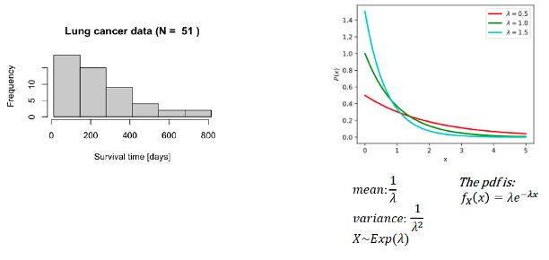

## The Uniform Distribution
Data can also be described using the uniform distribution, either at a continuous or a discrete scale. An example of data corresponding to a uniform discrete distribution would be the outcomes from rolling a die where the likelihood of any of the sample outcomes is the same. 

In clinical research, uniform distributional models are very useful when we want to randomise study participants into different study arms, and we want an equal, number of participants across all the arms.

## The Binomial Distribution
The binomial distribution describes successes of a fixed number of trials where each trial can either be a success or failure (so called Bernoulli trials, a sequence of Bernoulli trials is called a Bernoulli process). The probability of a successful trial is constant across all of these trials and the trials are independent. The distributional model requires two parameters, the number of trials (*n*) and the probability of success (*p*). We can use this to define the probability distribution given a set a fixed number of trials. 

In the example below I sample theoretical survival data based on Fazlinovic *et al.* 2021. In the study, the researchers examined survival outcomes 30 days after surgery. In 421 patients a survival of probability of approximately 0.981 was observed. We can sample from this distribution by specifying the number of trials (representing the number of patients going through surgery), and the survival probability.

The binomial probability curve can be a bit tricky to interpret, on the y axis we see the probability *k* successes (*n*) on the x axis. In a hundred trials the probability of success is around 98%, in other words the probability of survival is very high. 

```{r}
## Binomial distribution
# we can use the binomial pmf to generate data for the success of a
# hypothetical surgery e.g., p: 0.981, n: 421 (based on Fazlinovic et al. 2021)
surgery_stats <- rbinom(421,1,0.981)
n_count <- length(surgery_stats)
# we can plot the data using for example a bar plot grouped by successes and failures:
count_outcome <- table(surgery_stats)
barplot(count_outcome, names=c("deceased","survived"), main = paste("30-day outcome
(N=",n_count,"patients)"), xlab = "Outcome", ylab = "Frequency")
# we can then get the proportions of the two outcomes
probs <- prop.table(count_outcome)
# the probability of survival is then:
p_success <- as.numeric(probs[2])
# we can then plot the probability mass function for a binomial distribution
# in this case, the probability of number of successes given 100 trials
pmf_binom <- dbinom(x = c(0:100), size = 100, prob = p_success)
plot(0:100, pmf_binom, type = "l", ylab ="Probabilities")

```

## The Poisson Distribution
The Poisson distribution is a discrete probability distribution that expresses the probability of a given number of events occurring at a fixed time interval or for a fixed geographic area. The lambda represents the average number of events occurring within a time interval. As an example, the Poisson distribution is used to model patient arrival data at the emergency department. Here I sample a number of arrivals at an emergency department based on the work by Reboredo *et al.* 2023. We can then get an idea of the approximate number of patient arrivals over a full day at the emergency department.

```{r}
## Poisson distribution
# we can simulate emergency department arrival data based on Reboredo et al. 2023
# The study indicates mean/gamma arrivals of 400.96 patients during 2015-2020
n_samples <- 1000
dat_arrival <- rpois(n_samples, 400.96)
hist(dat_arrival, xlab = "Number entries", ylab = "Frequency",
main = paste("ED arrival data (N = ",n_samples,")"))

```

## Conclusions
We have looked at a few of the most commonly assumed probability distributions and examples of how we can make use of these. There are of course many other parametric distributional models, some more flexible and exotic than others, e.g., the Weibull and Beta distribution. In some cases, we might want to transform variables to make it more suitable for the assumptions of a statistical analysis. Typically what we try to do then is to somehow normalise the data. One way of doing that, for example, is if we have a dataset that behaves according to a lognormal distribution is to log-transform the data. This will produce approximately normally distributed data. There are also more flexible solutions like the Box–Cox transformation developed by George Box and David Cox, amongst others. 

Given the parametric distributions, there are implications of carrying out repeated samples from these. One of these principles is the law of large numbers, stating that as the sample size increases, the sample mean tends to get closer to the true population mean. In other words, averages calculated from larger samples generally provide more stable and reliable estimates than averages calculated from smaller samples.

Another classic principle is the central limit theorem. It states that if we repeatedly take sufficiently large samples of independent and identically distributed observations from a population with a finite mean and variance, the distribution of the sample means will approach a normal distribution as the sample size increases—even if the original data are not normally distributed. The same applies to sample sums after appropriate centring and scaling. It's used in a variety of places that require limiting theorems in probability. We'll talk more about that later (it gets a bit controversial). 

Then there are those that assume, nonparametric distributions or distribution-free distributions. Meaning that we don't assume any specific probability distribution. Rather, we describe the data at hand using, for example, histograms or kernel density estimators. But I will say this is the exception. In my community of pharmacological modeling, I can only think of two researchers over several years that were proponents of these approaches.

# L1-4 Sampling from Distributions
Sampling from distributional models is an important methodological tool in statistical analysis and modelling, the approach is regularly used to inform experimental design, sample size estimation and not least for simulations. The foundation of Monte Carlo simulations (that are widely used across modelling disciplines) rely on univeriate and multivariate random sampling from distribution models. 

Here we will take a closer look at how we can sample from defined distributional models. But, before we can do that we usually have to estimate distributional parameters based on a set of observed data and an assumed distributional model. Let's walk through an example, previously we took a look at the NHANES height data for adult males. The data appeared to be well-described with normal distribution. So, we have a set of data points *y* and we want to define *μ* and *σ²*. For some distributions we can calculate these using the closed-form maximum likelihood estimates (e.g., normal and lognormal distributions), for other distributions we optimise the parameters based on the log-likelihood (*ll*) function (*e.g.*,minimise the negative *ll* by searching for the optimal parameter values).

In R, we can do this using the *fitdistr* function in the library MASS. Libraries of functions can easily be installed using the function *install.packages("NameOfLibrary")*, we can then load the library using the function *library(NameOfLibrary)*. Most libraries will also have quite extensive documentation on the implemented functions (or datasets), what algorithms are implemented and how to use these. You  find this documentation in the library vignette. For example, you can view the MASS vignette here [**ADD REF**]. 

Let's test this out for the NHANES subset by estimating the parameters for the normal distribution (using the closed-form solutions) and the more Weibull distribution (estimated through numerical optimation). The Weibull distribution is quite useful in those cases where you need to fit a flexible parametric distribution that can fit a variety of data distributions by fitting the shape parameter (*k*) and the scale parameter (*lambda*). Sometimes you might find that many of these such functions will be sensitive to the initial inputs that you input (so you might have to play around with the initial estimates in some cases). We also make use of the *dplyr* library (extremely useful for data formatting), and of course *NHANES* (for loading the dataset).

```{r}
## Distribution Estimation & Sampling
#  Let's use adult male height from NHANES:
library(NHANES)
library(dplyr)
library(MASS)

# Filter the data for adult males
nhanes_subset <- NHANES %>%
  filter(Age > 18 & Gender == "male")
n_height <- sum(complete.cases(nhanes_subset$Height))

nhanes_height <- na.omit(nhanes_subset$Height)

# Use the package MASS to fit a normal distribution to the data
# This will make use of the closed form solution
normal_params <- fitdistr(nhanes_height, "normal")

# Distributions like the Weibull require numerical optimisation
# we can test this out as well (note that this may be sensitive to initial estimates)
weibull_params <- fitdistr(nhanes_height, "weibull", list(shape = 20, scale = 200))

# We can then produce a plot of the data and the two pdfs of the fitted distributions
# First we need to specify a few things...
# set inputs for pdfs
height_min <- min(nhanes_height)
height_max <- max(nhanes_height)
x_pdf <- seq(height_min, height_max, 1)

# Then we sample from the pdfs using the parameter estimates
y_norm <- dnorm(x_pdf, normal_params$estimate["mean"], normal_params$estimate["sd"])
y_weib <- dweibull(x_pdf, weibull_params$estimate["shape"], weibull_params$estimate["scale"])

# we start with a histogram, specifying to plot the density (freq = FALSE)
hist(nhanes_height, freq = FALSE, xlab = "Height [cm]", ylab = "Density", main = "NHANES height")
lines(x_pdf, y_norm, col="blue")
lines(x_pdf, y_weib, col="red")
legend(x = "topleft", c("normal","Weibull"), col=c("blue","red"), lty = 1, cex = 1)

```

Above we have a histogram of the observed height data in adult males, the blue curve describes the *pdf* assuming a normal distribution. And, the red curve describes the Weibull distribution. We also get the parameter estimates. 

Then we can carry out multiple sampling from the two distributional models and compare our results. Here we can specify in R how many samples we want to sample from these distributions.

To sample from a normal distribution, we use the *rnorm* function together with our estimated parameters for the mean and the standard deviation. We can do the same for the Weibull distribution using this *rweibull* function. Super straightforward. Here I overlaid the two histograms of the simulated sampled data for the normal and the Weibull. 

```{r}
## Distribution Sampling
# to sample from distributions we can use the rnorm and rweibull functions, super easy:
n_samples <- 1000
norm_sample <- rnorm(n_samples, normal_params$estimate["mean"], normal_params$estimate["sd"])
weib_sample <- rweibull(n_samples, weibull_params$estimate["shape"], weibull_params$estimate["scale"])

# we can then plot these as two overlaying histograms
color1 <- rgb(20, 23, 219, max = 255, alpha = 100) # blue
color2 <- rgb(219, 20, 20, max = 255, alpha = 100) # red

h1 <- hist(norm_sample, plot = FALSE)
h2 <- hist(weib_sample, plot = FALSE)

plot(h1, col = color1, xlab = "Height [cm]", ylab = "Frequency", main = "Sampling")
plot(h2, col = color2, add = TRUE)
legend(x = "topleft", c("normal","Weibull"), fill=c("blue","red"))
```

Under the hood, they rely on quite different methods for how this sampling is carried out. For example, we can have inverse, transforming sampling for a normal distribution. This is a method for generating random numbers from pretty much any probability distribution by using its inverse cumulative cumulative distribution. Or, specifically for the normal distribution we have the box transformation, where we generate random samples in pairs. Then these will be converted to normally distributed data. But, we save this topic for another course.

# L1-5 Hypothesis Testing
In this section we will take a closer look at hypothesis testing. Earlier, I talked about the hypothetico-deductive approach that George Box presents in his book on Statistics for Experimenters. The approach includes the generation of a hypothesis or theoretical model that is used to anticipate the experimental outcome. Then, we carry out the experiment, we make observations and we update our prior knowledge based on the new observations. Here we have a problem, the experiment is only carried out on a sample (or subset) of the full population of the real-world experimental system. We need to make inferences about the overall population based on the experimental sample. How do we go about doing that? 

This is where hypothesis testing comes in. William Gosset, a chemist at Guinness, was facing this exact problem in the early 1900s. At this time, the brewing industry was at the forefront of technological development (in a way it was the Silicon Valley of the early 1900s). Gosset was experimenting with different batches of barley and optimisation of the brewing process. But how could he make sure that he was making accurate inferences about the totality of crop based on a small experimental sample of barley?

With the help of the polymath Karl Pearson, Gosset developed the t-test and Student's t-test (Student was Gosset's pen name in the original paper). And later on, Ronald Fisher made contributions to the development of the t-test (perhaps most notably, the p-value). That's a lot of famous people working on a problem.  

Let's take a look at the original dataset from Student 1908 paper. In the original dataset we have barley head corn per acre (in lbs of weight) and we are looking at non-kiln-dried (NKD) barley seeds vs kiln-dried (KD) barley seeds. We can formulate the: 

* Research question, *e.g.*: Does kiln drying barley seeds impact barley crop yields?
* Null hypothesis ($H_0$): the mean barley crop sizes do not differ between the two batches of seeds, ($\mu_{yield,NKD} = \mu_{yield,KD}$).
* Alternative hypothesis ($H_1$): the mean barley crop sizes differ between the two batches of seeds, ($\mu_{yield,NKD} \neq \mu_{yield,KD}$).
* At a significance level of $\alpha = 0.05$ (we will go through this in more detail later). 


The original yield data is quite small, so we can easily load it into R manually as two vectors. We want to test the difference in means compared to the variability within both groups, we then calculate the t-metric. For a simple t-test this is quite easy to do by hand or we can use the built in function *t.test()*.

We need to specify if we want a two-sided t-test, if the data is paired, if we assume equal variances, and the significance level.

```{r}
# Student's t-test Guinness data
yield_nkd = c(1903, 1935, 1910, 2496, 2108, 1961, 2060, 1444, 1612, 1316, 1511)
yield_kd = c(2009, 1915, 2011, 2463, 2180, 1925, 2122, 1482, 1542, 1443, 1535)
n_nkd <- length(yield_nkd)
x_nkd <- mean(yield_nkd)
sigma_nkd <- sd(yield_nkd)
n_kd <- length(yield_kd)
x_kd <- mean(yield_kd)
sigma_kd <- sd(yield_kd)
df <- n_kd + n_nkd - 2
var_tot <- ((n_nkd - 1)*sigma_nkd^2 + (n_kd - 1)*sigma_kd^2) / (n_nkd + n_kd - 2)
tstat <- (x_nkd - x_kd) /(sqrt(var_tot*((1/n_nkd)+(1/n_kd))))
# at the degrees of freedom (df=20) we get a t-statistics of 0.234
# compared to the t-distribution table at 95% two-sided, 0.234 is smaller than
# 2.086. In fact, 0.234 is smaller than 50%. So, the p-value is larger than
# 0.50. Therefore, we do not reject the null hypothesis.
# table: https://en.wikipedia.org/wiki/Student%27s_t-distribution
# we can also retrieve the p-value using the following function:
p_value <- 2 * pt(abs(tstat), df, lower.tail = FALSE)
# Let's verify our calculations using R's built-in function (or the other way around :-) ):
stat_res <- t.test(yield_kd,yield_nkd, alternative = "two.sided", paired = FALSE,
var.equal = TRUE, conf.level = 0.95)
# comment: indeed, we get a p-value of 0.8173 and can therefore not reject the null hypothesis.
stat_res
```

When we calculate the t-statistic we get a value of 0.331. The get the p-value, we look this up  in the t-table based on the degrees of freedom(the sample size minus two, for the two groups, in this case). We get a p-value of above 0.5, or more precisely 0.817. We do not reject the null hypothesis at an α or significance level of 0.05. 

We can generalise this approach to the following steps: 

* Formulated the null and alternative hypothesis. 
* Carry out the experiment and collect data. 
* We carry out the t-tests and we calculate the t-statistic (the difference in group means over the standard error). The *t* is then the number of standard errors away from the mean. 
* Look up what p-value the t-statistic corresponds to in the t-table. 
* The p-value is the probability of obtaining the same results or a larger difference if the null hypothesis were to be true.
* Draw a set of conclusions with regards to the null and alternative hypothesis.

In the Wikipedia image below (Figure 1.9), we can see that the t-distribution has heavier tails at smaller sample sizes (fewer degrees of freedom). The heavier tails reflect the greater uncertainty associated with estimating the population standard deviation from a small sample. Consequently, for a given observed t-statistic, a smaller sample generally produces a larger p-value and requires a more extreme t-statistic to reject the null hypothesis. 

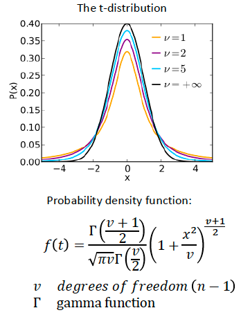

*In other words, the t-statistic and its degrees of freedom determine the p-value: the probability, assuming that the null hypothesis is true, of obtaining a t-statistic at least as extreme as the one observed. For the same observed t-statistic, fewer degrees of freedom produce a larger p-value because the t-distribution has heavier tails. We therefore require stronger evidence to reject the null hypothesis when the sample size is small.*

## Parametric t-tests
The standard t-test we are familiar with is a so called parametric t-test, this relates to the parametric distributions (distributions that can be described using parameters). We are assuming a parametric distribution of the data we are analysing, for most tests we are assuming that the data approximates the normal distribution (but not always).

The parametric t-tests are subject to a number of assumptions and conditions, the flavour of t-test will depend on these characteristics. In R, we can use the same function, *t.test(...)* with different inputs to carry out any of these parametric t-tests. Figure 1.10 gives a summary of the conditions that need to be met and how to choose and appropriate t-test.

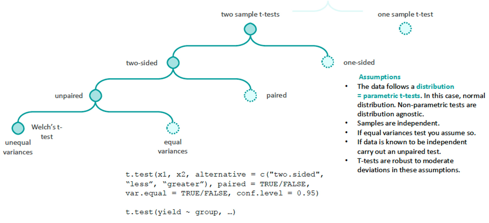

### Parametric t-tests: The Normality Assumption
The best-known assumption of the parametric t-test is approximate normality. This applies to the outcome within each group for an independent-samples test and to the within-pair differences for a paired test. Normality should ideally be considered when planning the analysis, but it can also be assessed visually using Q–Q plots, histograms and box plots. 

```{r}

# To better understand data in an exploratory fashion we can visualise it:
## normality
# Let's take a look at the height data in NHANES again
library(NHANES)

# Filter the data for adult males
nhanes_subset <- NHANES %>%
filter(Age > 18 & Gender == "male")
n_height <- sum(complete.cases(nhanes_subset$Height))
nhanes_height <- na.omit(nhanes_subset$Height)

# summary statistics
summary(nhanes_height)

# q-q plot: there are many functions for these, for example:
library(car)
qqPlot(nhanes_height, xlab = "normal quantiles",
ylab ="NHANES: height [cm]")

# boxplot
boxplot(nhanes_height, xlab = "NHANES: adult males",
ylab = "Height [cm]")

# histogram
normal_params <- fitdistr(nhanes_height, "normal")
height_min <- min(nhanes_height)
height_max <- max(nhanes_height)
x_pdf <- seq(height_min, height_max, 1)
y_norm <- dnorm(x_pdf, normal_params$estimate["mean"],
normal_params$estimate["sd"])
hist(nhanes_height, freq = FALSE, xlab = "Height [cm]",
ylab = "Density", main = "NHANES height")
lines(x_pdf, y_norm, col="blue")
legend(x = "topleft", c("normal"), col=c("blue"),
lty = 1, cex = 1)

```

Above we investigate normality using the following methods:

* Summary statistics: we can get an indication of symmetry and spread by comparing the median and the mean, the interquartile range, maximum and minimum data points. 
* Q-Q plot: for a normal Q-Q plot, we assess normality by how closely the data points follow the line of unity. 
* Box plot: informative for visually assessing symmetry and variability based on the plotted quartiles. 
* Histogram: visual assessment of distribution of data, we can also overlay a fitted *pdf* to assess normality. 
* Skewness and kurtosis: these provide additional information about asymmetry and the "heavy-tailedness" of the data. To calculate these metrics we can use the functions *skewness(data)* and *kurtosis(data)* in the library *moments*.

Formal normality tests such as Shapiro–Wilk are generally not necessary. In small samples, they often miss deviations from normality and in large samples they will find trivial deviations significant. Visual assessment is usually more informative. Statistical tests of normality have their use cases, for example when assessing whether measurements in the manufacturing process follow an approximately normal distribution as supporting evidence for quality control.

### Parametric t-tests: The Equal Variances Assumption
The conventional Student’s t-test also assumes equal variances between groups. When this assumption is doubtful, Welch’s t-test should be used. Again, there are statistical tests of homogeneity of variances across groups, but each test will carry the risk of producing false positives. In practice, assuming unequal variance is often a sensible default because reduces the number of assumptions regarding the data. 

### Parametric t-tests: Paired or unpaired tests
Whether to use a paired or unpaired test is usually determined by the study design. When observations are genuinely paired, a paired test is preferable because it accounts for within-pair variation and often provides greater statistical power. Rather than comparing two group means directly, it tests whether the mean difference within pairs differs from zero.

### What is the Meaning of the p-value
The p-value is much talked about, but often misunderstood. It can be a bit tricky to wrap your head around, I have to remind myself on a regular basis what it means (probably because I spend very little time concerning myself with p-values when doing statistical modelling, but more on this another time). The p-value level of significance of 0.05 was originally defined by Ronald Fisher as a: *"limit in judging whether a deviation ought to be considered significant or not"* (the quote is from his original paper). What does *p* mean then? The *p*-value is the probability of obtaining the t-statistic, or a more extreme value, if the null hypothesis were to be true. Where the t-statistic is deviation from the mean for normal parametric t-test. 

We can also describe it with the help of Dr Andrew Gelman (a well-renowned Bayesian statistician of our time): *p* is the probability of *t*, upon repetition, being larger than the *t* that we got in our experiment if the null hypothesis were to be true. 

Statistical tests may produce either false-positive results (Type I errors) or false-negative results (Type II errors), as illustrated in Figure 1.11. The probability of a Type I error is determined by the significance level, α, for example, α=0.05 corresponds to a 5% risk of rejecting a true null hypothesis. The probability of a Type II error is denoted by β, while statistical power is 1−β. Thus, a power of 80% corresponds to a 20% risk of failing to reject the null hypothesis when the specified alternative hypothesis is true.

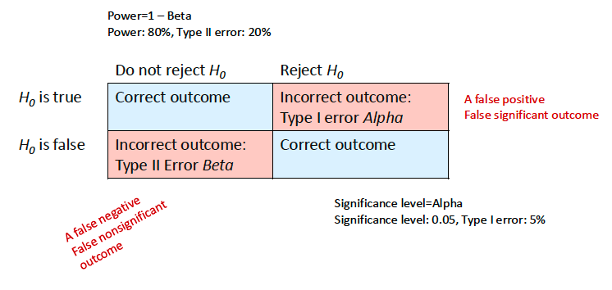

Multiple testing increases the family-wise error rate—the probability of making at least one Type I error across a set of tests. For m independent tests with α=0.05, this probability is $(1-0.5^{n,tests}$, for 10 tests this is approximately 40%. Corrections such as Bonferroni reduce this risk by using a threshold of α/n_tests, although this may also reduce power. Adjustment is particularly important when many unplanned comparisons are performed.

Statistical significance should be considered alongside effect sizes and confidence intervals (Figure 1.12). Effect sizes describe the magnitude of a difference in a standardised form, while confidence intervals indicate its estimated precision. A 95% confidence-interval procedure will contain the true population parameter in 95% of repeated samples.

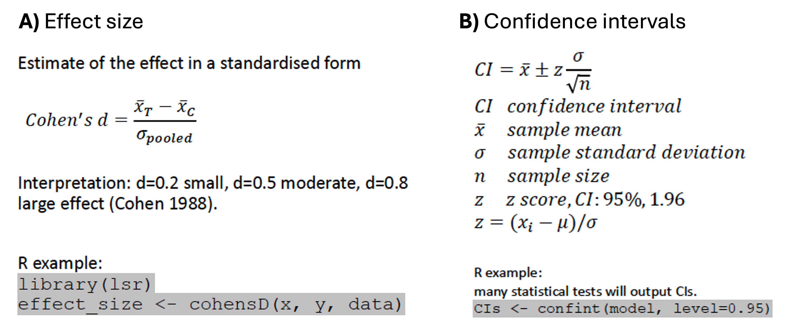

Finally, statistical significance does not necessarily imply clinical significance. A small effect may be statistically significant in a large sample without being clinically meaningful. Clinical relevance must therefore be judged using domain knowledge and predefined thresholds. Hypothesis testing is only one part of the scientific process and should complement exploratory analysis, modelling and continued learning from data.

# L1-6 Nonparametric Statistical Tests
Parametric tests assume a particular distribution of the analysed data (clarification according to the discussion above: parametric tests assume that the analysed data can Approximately be described according to a given distributional model, such as the normal distribution). Nonparametric tests are in general distribution-free tests, meaning that they do not assume any particular distribution for the underlying data that we are testing (they can be conditional based on other assumptions as we will see below).

Classical nonparametric methods rely on either sign conversion of data, *i.e.*, if *X* is smaller than some value, then it's counted as negative one (-1), if *X* is larger than some value, then it is assigned a positive value (+1); or, ranking of data (in order of size), or a combination of both approaches. But, the nonparametric methods are by no means limited to these techniques, modern techniques include permutation tests and bootstrapping. These are extremely flexible and useful techniques.

## The Sign Test
The simplest nonparametric test is perhaps the sign test, a one-sample or paired test of medians. This test was developed by Dr John Arbuthnot in the early 1700s (Arbuthnot 1710) and therefore it predates the normal parametric statistical tests by almost exactly 200 years (Student 1908). 

Dr Arbuthnot was investigating the differences in birth rates between males and females in London based on christening records. Today there are more well-suited tests for the analysis. So instead, I am demonstrating the sign test on a naevus (mole) count data used to estimate the risk of melanoma (Based on Ribero *et al.* 2016). To determine the best method for mole count, the authors tested for a difference in mole count on the left vs right arm for a number of individuals. In statistical wording, this was a paired experiment, exploring the research question wether mole counts differ on the left and right arm, the tested hypotheses were therefore:

* $H_0$: median mole count on the left arm equals the right arm.
* $H_1$: median mole count on the left arm differs from the right arm.

We can calculate this sign based on the data, *i.e.* if the left arm has a higher mole count than the right arm we assign a value of +1, if the opposite is true then -1, and if equal then 0. We then sum up the number of successes, the negatives and the ones that are equal. 

Then we test the relative number of successes against the probability of 0.5, meaning the null hypothesis - that successes are as likely as failures. This is very straightforward to do in R using the *binom.test()* function, specifying the number of successes (+1) and trials (rows), so that: *binom.test(n_successes, n_trials, alternative = "two.sided", conf.level = 0.95)*. For the mole count data we get a *p*-value of 0.61, meaning that we do not reject the null hypothesis. 

## The Wilcowon Signed Rank Test
The Wilcoxon signed rank test is the preferred method over the much simpler sign test alone. The reason is that making use of additional information in the data differentiate between the groups. The calculated *t*-statistic is based on the sign and the rank. We calculate a *p*-*value by comparing *t* to its distribution under the null hypothesis. We also have an unpaired alternative here which is the Wilcoxon rank sum (also called the Mann–Whitney U test).

We can use the Wilcoxon signed rank test for the same mole count data to test the median mole count on the right versus left arm. In R, we can do this using the function *wilcox.test(right_arm, left_arm, paired =
TRUE, exact = TRUE)*. In this case we then get a *p*-value of 0.13, meaning that we do not reject the null hypothesis. 

## Side Note: Back to Arbuthnot's Experiment
Sorry to sidetrack you once again, but you may be curious about which statistical test would be suitable for John Arbuthnot’s research problem. If not, feel free to skip this section.

I managed to find Arbuthnot’s original data from the early 1700s. He examined the annual numbers of male and female christenings, using christenings as a proxy for births. Using the sign test, Arbuthnot concluded that more boys than girls were born and that this pattern was consistent across the years.

Today, we could refine the research question by asking whether the overall proportion of male christenings differed from 0.5. We can begin by plotting the annual proportions, which tend to remain above 0.5.

We would then use a test of proportions to compare the observed proportion with the expected proportion of 0.5. Unlike the sign test, which considers only whether each year had more male or female christenings, the proportion test uses the actual numbers of christenings. The resulting *p*-value is sufficiently small to reject the null hypothesis. We therefore conclude that the observed proportion of male christenings differs significantly from 0.5 and is higher. 

## The Permutation Test
Resampling methods allow us to perform highly flexible nonparametric analyses without specifying a particular probability distribution. Two important resampling methods are permutation testing and bootstrapping. Although they are related, they serve different purposes: permutation testing is primarily used for hypothesis testing, whereas bootstrapping is commonly used to estimate uncertainty and construct confidence intervals.

To perform a permutation test, we first specify a null hypothesis and choose a test statistic. The useful thing about this approach is that the test statistic can be almost anything relevant to our research question, such as a difference in means, medians, proportions or 95th percentiles. This is actually quite cool!

Assuming that the null hypothesis is true, we repeatedly rearrange—or permute—the group labels while leaving the observed outcomes unchanged. For each permutation, we recalculate the test statistic. This produces a permutation distribution showing the values of the test statistic that would be expected if there were no genuine difference between the groups.

We can then calculate a p-value by determining the proportion of permuted test statistics that are at least as extreme as the statistic observed in the original data. Permutation tests rely on the observations being exchangeable under the null hypothesis. In a randomised experiment, this is supported by the random assignment of participants to groups. The correct permutation procedure must also reflect the study design *e.g.*, paired observations should be permuted within pairs rather than across all observations.

Let us apply this approach to a simulated dataset from a paediatric psychiatric study. The outcome is the Children’s Global Assessment Scale, or CGAS, which provides an overall assessment of psychological and social functioning. We want to determine whether CGAS scores differ between a treatment group and a control group. Our null hypothesis is that the median CGAS score is the same in the two groups, while the alternative hypothesis is that the medians differ. We can define our test statistic as the absolute difference between the two group medians (Figure 1.13)

We first calculate the observed median difference and then randomly permute the group labels many times—100,000 times in this example. After each permutation, we recalculate the absolute difference in medians.

We compare the observed statistic with the resulting permutation distribution. This gives us a p-value of approximately 0.001, providing strong evidence against the null hypothesis of equal group medians. Note that we do not have to do this manually, again there are plenty of implemented functions and packages we can make use of, *e.g.*, *library(perm)*.


## Bootstrapping
The permutation test tells us whether the observed difference is unlikely under the null hypothesis, but it does not directly quantify the precision of the estimated difference. For that purpose, we can use bootstrapping.

In bootstrapping, observations are repeatedly sampled with replacement, usually within each group. We calculate the difference in medians for every bootstrap sample and use the resulting distribution to construct a confidence interval. Using 10,000 bootstrap samples, we estimate a median difference of 10 CGAS points, with a 95% confidence interval from 6 to 13 points. Because this interval does not include zero, it is also consistent with a difference between the groups.

## The Wilcoxon Rank-Sum Test
We could apply a conventional nonparametric test to the same problem, such as the Wilcoxon rank-sum test, also known as the Mann–Whitney (U) test. This test is suitable for comparing two unpaired groups when the outcome is at least ordinal.

The Mann–Whitney test examines whether observations from one group tend to be higher or lower than observations from the other. It is not generally a test of medians; it can be interpreted as a test of location or median differences only when the two distributions have similar shapes and differ mainly in their location.

Running the test in R using *wilcox.test()* gives a p-value of approximately 0.0004. We therefore reject the null hypothesis and conclude that the distributions of CGAS scores differ between the treatment and control groups, with scores tending to be higher in one group.

This concludes our introduction to nonparametric tests. There are of course many other nonparametric statistical testing methods out there, And for most parametric tests there are usually nonparametric alternatives, AND for of course the parametric methods are not just limited to the ones based on the normality assumption. There is lots to consider in other words, but it does not have to be that complicated. The next section will discuss method selection in statistical testing.

# L1-7 Selection of Statistical Tests
So far, we have considered both parametric tests based on the normal distribution and nonparametric tests. In this section, I will share some thoughts on how to choose between them, focusing on the comparison between normal parametric t-tests and their nonparametric counterparts.

Three widely used statements on selection of statistical tests follow below. These principles provide a useful starting point, but they are oversimplifications. Let us examine them more carefully:

1. **If data is normally distributed, use a normal parametric t-test** rarely is real data normally distributed. However, t-tests are very robust to deviations from normality. Approximately normal is good enough. An approximately symmetric distribution without extreme outliers is often sufficient, particularly when the sample sizes are reasonably large and similar between groups. Remember that if our aim is to carry out a confirmatory data analysis, we should not let the data inform the analysis.
2. **Nonparametric tests are always valid but not always efficient** nonparametric test can often be applied to normally distributed data, but it may be less powerful than a parametric test when the assumptions of the parametric test are satisfied. Conversely, a nonparametric test may be more powerful when the data are strongly skewed or contain influential outliers. However, nonparametric tests are not automatically valid in every situation: they still make assumptions about matters such as independence, exchangeability and, depending on the intended interpretation, the shapes of the group distributions. Nevertheless, the choice should not be based on normality alone. Parametric and nonparametric tests may test different null hypotheses and describe different features of the data.

3. **According to the central limit theorem parametric t-tests are generally robust for n > 30 samples, regardless of the data type** This is also an oversimplification. The central limit theorem states that, under suitable conditions, the sampling distribution of the mean approaches a normal distribution as the sample size increases. However, there is no universal sample size threshold at which this approximation suddenly becomes adequate. The required sample size depends on the shape of the underlying distribution. If the data are approximately symmetric, a relatively small sample may be sufficient. If data are strongly skewed, heavy-tailed or affected by extreme outliers, a much larger sample may be required. We should therefore avoid treating this n=30 as a rigid rule.

What, then, is a reasonable approach to selecting a statistical test? Let's define a set of recommendations here:

1. **Consider the data type** For example, we would consider normal parametric t-tests for continuous data; The Wilcoxon Mann Whitney test is suitable for ordinal or continuous data, etc.

2. **Consider the test statistic** Consider which characteristic of the data is relevant to the research question. Are we interested in a difference in arithmetic means, geometric means, medians, distributions or something else? The test statistic and null hypothesis should correspond to the scientific question we actually want to answer. It may also be reasonable to transform the data. For example, if positive continuous data are approximately lognormally distributed, we could log-transform the observations and apply a t-test on the logarithmic scale. The assumptions must also match the study design, *i.e.*, for an independent-samples t-test, normality concerns the outcome distribution within each population or group; for a paired t-test, the normality assumption applies to the within-pair differences.

3. **Consider prior data** We can consider which methods have been used previously, what is known about the outcome distribution and what is standard practice within the discipline. Exploratory data analysis can help us understand the data, but in confirmatory research the main analysis should be prespecified. In uncertain situations, simulation can also help us investigate how candidate methods are likely to perform (in terms of power and robustness).

## Simulating the Relative Power (1 - Beta) of Two Statistical Tests
When we describe a statistical test as robust, we mean that it continues to perform reasonably well despite some violation of its assumptions. One important aspect of robustness is whether the test maintains the intended type I error rate, the probability of obtaining a statistically significant result when the null hypothesis cannot be rejected. We may also consider its power, which is the probability of detecting a specified effect when that effect is genuinely present.

Simulations provide a method for examining test properties. We can explore the relative power of two tests by:

1. **Specifying a model and effect** define a distributional properties of the data and an effect size.
2. **Generate observations** this can be done through resampling.
3. **Test the hypothesis** test two models.
4. **Repeat and calculate power** repeat the simulation experiment 10,000 times and calculate the power of the two tests (the proportion of significant outcomes per test is the power, ($1 - \beta$)).

Let's go through an example. We generate two groups of 15 observations from a strongly skewed lognormal distribution and introduce a specified difference between the groups. We then compare the performance of a parametric unpaired t-test with that of the Wilcoxon–Mann–Whitney test.

```{r}
set.seed(34567)

x_contr <- 0.4
sd_contr <- 0.49
n_control <- 15
x_exp <- 0.95
sd_exp <- 0.51
n_experiment <- 15
pval_wmw <- replicate(10000, {
y_contr <- rlnorm(n_control, x_contr, sd_contr)
y_exp <- rlnorm(n_experiment, x_exp, sd_exp)
wilcox.test(y_contr, y_exp)$p.value
})
cat("Power of Wilcoxon Mann Whitney:", mean(pval_wmw < 0.05), "\n")

set.seed(34567)
pval_ttst <- replicate(10000, {
y_contr <- rlnorm(n_control, x_contr, sd_contr)
y_exp <- rlnorm(n_experiment, x_exp, sd_exp)
t.test(y_contr,y_exp, alternative = "two.sided", paired = FALSE,
var.equal = FALSE)$p.value
})
cat("Power of t-test:", mean(pval_ttst < 0.05), "\n")

```

In this example, the Wilcoxon Mann Whitney test has a slight advantage in terms of power, although the performance of the two tests is fairly similar despite the considerable skewness of the data. This illustrates that the t-test can remain useful even when its normality assumption is not perfectly satisfied. However, these tests should not be viewed as interchangeable. The t-test evaluates a difference in means. The Wilcoxon–Mann–Whitney test more generally evaluates whether observations from one group tend to be higher or lower than observations from the other. It can be interpreted as a test of medians only under additional assumptions, when the two groups have similarly shaped distributions that differs in terms of central tendency.

## Simulation Experiments of the Significance Level (Alpha)

We can also use simulations to investigate whether the normal parametric t-test maintains its nominal significance level under non-normality. This is perhaps a bit more theoretical and not something we would typically explore, but I still think it is useful to see what the impact is. Under ideal conditions, the test statistic follows the theoretical t-distribution when the null hypothesis is true. If the data are strongly non-normal, however, the actual distribution of the test statistic may differ from the theoretical distribution. The calculated *p*-values may then be too small or too large, causing the type I error rate to deviate from the intended value.

For example, suppose that we repeatedly generate samples from the same exponential distribution, so that the null hypothesis is true. We first generate two groups of 10 observations and then repeat the simulation with two groups of 30 observations. For each simulated dataset, we calculate the t-statistic and compare the resulting empirical distribution with the corresponding theoretical t-distribution.

```{r}
set.seed(34567)

n_repeat <- 10000
gamma_y <- 1

for (n_samples in c(10, 30)) {

  # Calculate the t-ratio for each simulated sample
  t_y <- replicate(n_repeat, {

    y_dat <- rexp(n_samples, rate = gamma_y)

    x_y  <- mean(y_dat)
    sd_y <- sd(y_dat)

    (x_y - gamma_y) / (sd_y / sqrt(n_samples))
  })

  # Calculate the corresponding theoretical t-distribution
  df_y <- n_samples - 1
  x_tdist <- seq(-8, 8, length.out = 500)
  tdist_pdf <- dt(x_tdist, df = df_y)

  # Plot the simulated t-ratios
  hist(
    t_y,
    freq = FALSE,
    breaks = 50,
    xlab = paste0("t-ratio (n = ", n_samples, ")"),
    ylab = "Density",
    main = "",
    xlim = c(-8, 8),
    ylim = c(0, 0.5),
    col = "lightblue",
    border = "white"
  )

  # Overlay the theoretical t-distribution
  lines(
    x_tdist,
    tdist_pdf,
    col = "red",
    lwd = 2
  )
}
```

With 10 observations per group, the empirical distribution of the t-statistics may show noticeable skewness relative to the theoretical distribution. With 30 observations per group, much of this discrepancy may have disappeared. In this particular example, the t-test therefore becomes increasingly robust as the sample size grows.

## Conclusions
The broader lesson is that no single rule can determine which statistical test will work best under a given circumstance. We should consider the research question, the data type, the effect we want to be able to detect, the study design, what distributional model that approximates the data, the sample size and the assumptions and interpretation of each candidate statistical test. Parametric t-tests are often quite robust (if not very robust!) when sample sizes are adequate and the data are not extremely skewed or dominated by outliers. Nonparametric or alternative modelling approaches may be preferable in other circumstances.

# L1-8 Study Design (I)
This section concludes Part One of the course notes. Here, I will translate some of what we have learned into practical advice on study design. We will return to this topic again later on the course. 

The intellectual roots of systematic experimentation extend back more than two thousand years, including the work of Aristotle and other ancient scholars. Around the year 1000, Ibn al-Haytham combined systematic observation, controlled experimentation and mathematical reasoning in his influential studies of optics and the camera obscura, building on ideas found in earlier scientific traditions. Experimental science continued to develop through the work of Francis Bacon and many others, while modern statistical experimental design was largely established by Ronald A. Fisher in the twentieth century. Particularly relevant to clinical and epidemiological research were the influential studies of smoking and lung cancer conducted by Richard Doll, Austin Bradford Hill and others during the 1950s.

For now, we will focus on a few fundamental study design aspects. A useful way to frame these is through George Box’s view of experimentation: if we want to understand what happens when we intervene in a system, we must actively study the consequences of that intervention.

This leads us to two central questions. First, "what causes what?" Identifying an association is not the same as demonstrating causation. Second, "how do we account for variability?" Experimental outcomes vary for many reasons, and good study design aims to control, balance or measure the factors that may influence the system under investigation.

Models can support study design in several ways, a topic we also consider in the simulation methods course. Strong theoretical and clinical frameworks can help us design studies that are more likely to identify causal effects while reducing the influence of confounding factors.

One simple framework for developing a clinical research question is PICO:

* **Population:** Who is the study intended to represent?
* **Intervention:** What treatment or exposure is being investigated?
* **Comparator:** What is the intervention being compared with?
* **Outcome:** What will be measured, and is that measure valid and relevant?

Although simple, PICO provides a useful structure during the early development of a study.

Figure 1.14 provides a summary of some of the study design learnings so far. One aspect is the type of data collected and the statistical test that will be used. These choices affect both the interpretation of the results and the statistical power of the study.


When appropriate, a continuous quantitative outcome generally retains more information than converting the same outcome into categories. For example, measuring heart rate numerically will usually provide more information than classifying participants only as having or not having tachycardia. However, the outcome should ultimately be selected for its clinical relevance and measurement validity, not merely because continuous outcomes may offer greater statistical power.

We must also reduce the risk of confounders. In randomised studies, random allocation helps balance both known and unknown confounding factors between treatment groups. Stratification, restriction or matching may also be used to improve balance for important factors such as age, sex and comorbidities. In observational studies, careful measurement and statistical adjustment for potential confounders become particularly important.

Hypothesis testing also provides a useful framework for study design. A clearly stated hypothesis helps define the groups being compared, the outcome being measured, the effect of interest and the statistical analysis that will be performed (similar to the PICO above).

Prior evidence can then inform our assumptions. We might use previous studies or pilot data to approximate the distribution and variability of the response. We must also decide what magnitude of change would be scientifically or clinically meaningful: how large a difference would we regret failing to detect?

Prior to a study, plenty of work can be done to ensure that we maximise the learning in the study. This is both cost effective and ethical, clinical studies are often very expensive and we do not want expose individuals to experimental studies unnecessarily. Work can be done to approximate the distribution of the the response variable, define a meaningful change in the response (based on domain knowledge), propose statistical analysis, investigate the ability of to detect a meaningful change given assumed variability, and investigate the impact of study power and sample size.

Simulations can be used to evaluate whether the proposed design and analysis are likely to detect the effect of interest under approximate conditions. Let's take a look at a simple example involving clozapine and its potential to increase heart rate. Suppose historical data suggest that resting heart rate in the relevant control population is approximately normally distributed, with a mean of 73 beats per minute and a standard deviation of 9 beats per minute. We can use this information as an approximate model for the control population. We then define the increase in mean heart rate that would be clinically meaningful and that we want the study to be capable of detecting.

If we assume that the two groups are approximately normally distributed, we can express the difference between their means as a standardised effect size using Cohen’s d:

($d = (\mu_{Treatment} - \mu_{Control}) / \sigma_{Pooled}$)

where ($\mu_{Treatment} - \mu_{Control}$) is the difference in means that we want to detect and ($\sigma_{Pooled}$) is the assumed common standard deviation.

We can then conduct a power calculation using the *pwr.t.test()* function from the *pwr* package in R. We specify the effect size, desired power, significance level and type of t-test (alternatively, we can calculate power across a range of sample sizes and plot the resulting power curve):

```{r}
set.seed(34567)
library(pwr) 
## Clozapine-induced tachycardia
# According to Persson et al. 2024, heart rate as bpm is approximately normal
# The mean (sd) heart rate is 73 (9) bpm. Under that assumption we can
# sample from the theorical distribution.

# Normal sampling
x_contr <- 73
sd_contr <- 9
nc_samples <- 1000
bpm_contr <- rnorm(nc_samples, x_contr, sd_contr)
# Data is continuous and approximately normal, suggesting suitability of a t-test.

# Tachycardia means a bpm of 100, but not the whole day.
# For simplicity, let's say we want to detect a difference 10 bpm.
x_treat <- 83
sd_treat <- 9

# calculate Cohen's d effect size
sd_pooled <- sqrt((sd_treat^2+sd_contr^2)/2)
es_d <- (x_treat - x_contr)/sd_pooled

# calculate power over sample size
p.t.two <- pwr.t.test(d = es_d, power = 0.80, type = "two.sample",
alternative = "two.sided")
plot(p.t.two, xlab = "sample size per group")
```

The above calculation indicates that 14 participants per group would provide 80% power to detect the prespecified difference at the chosen significance level. Under the assumptions used in the calculation, this would be our approximate minimum sample size.

This conclusion depends entirely on the assumptions on which the analysis is based. If the true variability is greater, the effect is smaller, participants drop out or the assumptions of the proposed analysis are not satisfied, the actual power may be lower. Sample size calculations should therefore be based on realistic and clearly justified assumptions, and they may need to include an allowance for missing data or dropout.

This is a simple but widely used approach to estimating the sample size required for a clinical or experimental study. More advanced designs may account for repeated measurements, longitudinal outcomes, clustering, multiple endpoints and other complexities.

Later in the course, we will examine these issues in greater depth, including how repeated measurements and longitudinal studies can strengthen our understanding of change over time. We will also return to causal reasoning and consider Bradford Hill’s viewpoints, which were developed in the context of evaluating evidence about associations such as that between smoking and lung cancer.

This concludes Part One of the course notes. I hope you have enjoyed it so far! Your feedback would be highly appreciated.

# Recommended Reading and Key Literature
::: {.callout-note appearance="simple" icon=false}

## Recommended Reading
- Lavine, M. (2013). Introduction to Statistical Thought. [Link text](https://www.example.com)

## Key Citations
- Box, G. E. P., Hunter, J. S., & Hunter, W. G. (2005). Statistics for Experimenters: Design, Innovation, and Discovery (2nd ed.). Wiley.
- Riffenburgh, R. H., & Gillen, D. L. (2020). Statistics in Medicine (4th ed.). Academic Press.
- Tukey, J. W. (1980). We need both exploratory and confirmatory. The American Statistician, 34, 23–25.
- Fife, D. A., & Rodgers, J. L. (2022). Understanding the exploratory/confirmatory data analysis continuum: Moving beyond the “replication crisis.” American Psychologist, 77(3), 453–466.
- Student. (1908). The probable error of a mean. Biometrika, 6(1), 1–25.
- Arbuthnot, J. (1710). An argument for Divine Providence, taken from the constant regularity observed in the births of both sexes. Philosophical Transactions of the Royal Society of London, 27, 186–190.

:::
